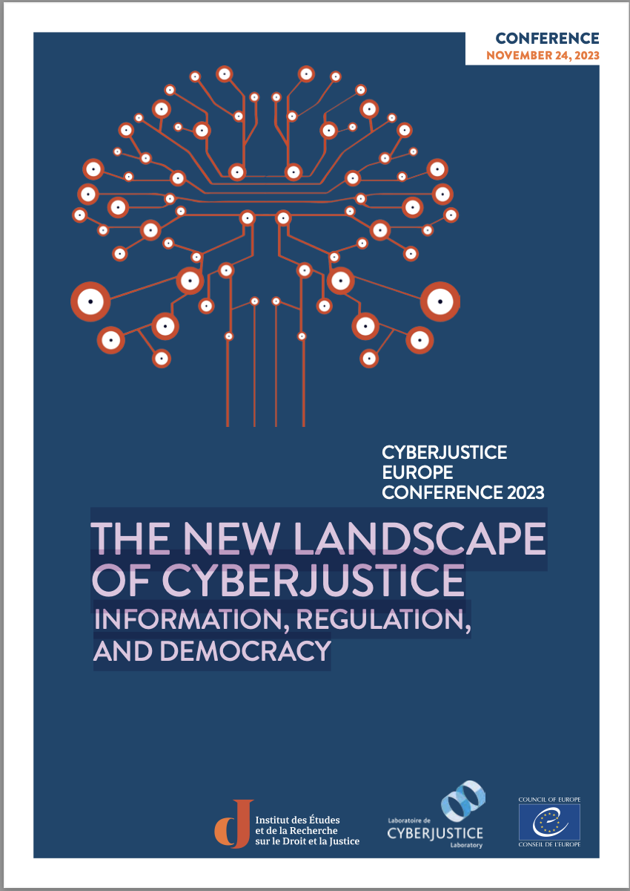

# Institut Robert Badinter ressources in English - Digital Justice

Welcome to Institut Robert Badinter international ressources on Digital Justice.

[Home](../index)   

## Decoding AI in 2025: INSIGHTS INTO A TECHNOLOGY ON ITS WAY OF NORMALIZATION
[Read on our website](https://institutrobertbadinter.fr/fr/publications/decoding-ai-in-2025/)

Bringing together legal professionals, researchers, and technology experts, this volume explores the technical, social, and legal implications of artificial intelligence for justice and the rule of law.
Drawing on interdisciplinary discussions held in Strasbourg, it aims to foster a common language on AI across law, computer science, philosophy, sociology, and political science.

> « Decoding AI in 2025 - Insights into a Technology on its Way to Normalisation », Strasbourg, Institut Robert Badinter, 2025. https://institutrobertbadinter.fr/fr/publications/decoding-ai-in-2025/

- Rules and regulations are vital for AI in the field of justice,   but how and why?, The new landscape of cyberjustice : Information, regulation, and democracy, Paris, Institut Robert Badinter, [s. d.], p. 11‑19. [Read](https://ierdj.fra1.digitaloceanspaces.com/media_library/2025/04/Actes-CyberJustice-ENG.pdf#page=11)
- How should justice systems  respond to increased cybercrime?, The new landscape of cyberjustice : Information, regulation, and democracy, Paris, Institut Robert Badinter, [s. d.], p. 20‑29. [Read](https://ierdj.fra1.digitaloceanspaces.com/media_library/2025/04/Actes-CyberJustice-ENG.pdf#page=22)
- Is the development of online dispute  resolution (ODR) in quest of an  essential public policy?, The new landscape of cyberjustice : Information, regulation, and democracy, Paris, Institut Robert Badinter, [s. d.], p. 30‑37. [Read](https://ierdj.fra1.digitaloceanspaces.com/media_library/2025/04/Actes-CyberJustice-ENG.pdf#page=32)
- New routes for legal   and judicial information?, The new landscape of cyberjustice : Information, regulation, and democracy, Paris, Institut Robert Badinter, [s. d.], p. 38‑47. [Read](https://ierdj.fra1.digitaloceanspaces.com/media_library/2025/04/Actes-CyberJustice-ENG.pdf#page=40)
- Distant or close horizons:   The emergence  of new legal  professionals, The new landscape of cyberjustice : Information, regulation, and democracy, Paris, Institut Robert Badinter, [s. d.], p. 48‑56. [Read](https://ierdj.fra1.digitaloceanspaces.com/media_library/2025/04/Actes-CyberJustice-ENG.pdf#page=50)

## The new landscape of cyberjustice : Information, regulation, and democracy
[Read on our website](https://institutrobertbadinter.fr/fr/publications/the-new-landscape-of-cyberjustice-information-regulation-and-democracy/)

Cyberjustice Europe 2023 convened leading experts from across Europe and beyond to examine the opportunities and risks created by digital transformation in justice.
Discussions focused on AI governance, cybercrime, online justice services, augmented legal professions, and the future of democratic institutions in a technological age.

> NAFIR-GOUILLON Stéphane et XAVIER CAYON (dir.), « The new landscape of cyberjustice : Information, regulation, and democracy », Nathalie NIELSON (trad.), Institut Robert Badinter. https://institutrobertbadinter.fr/fr/publications/the-new-landscape-of-cyberjustice-information-regulation-and-democracy/
