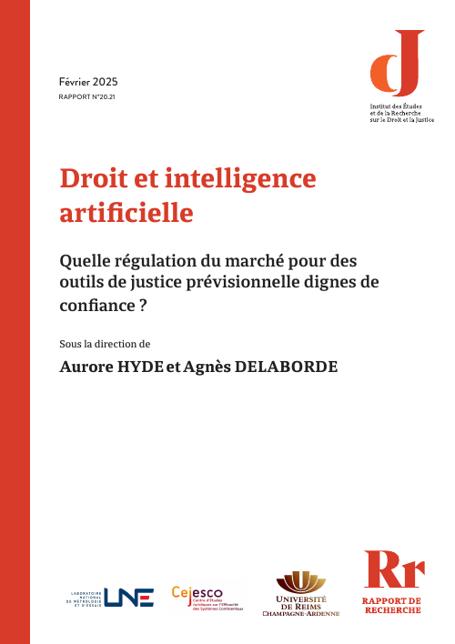
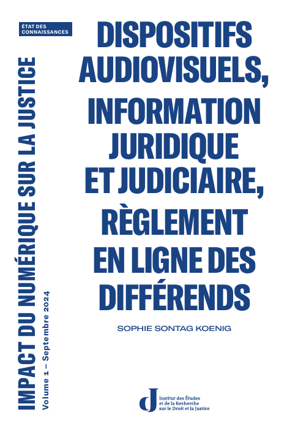
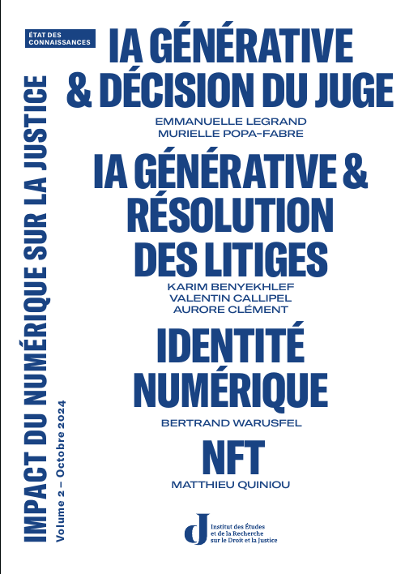
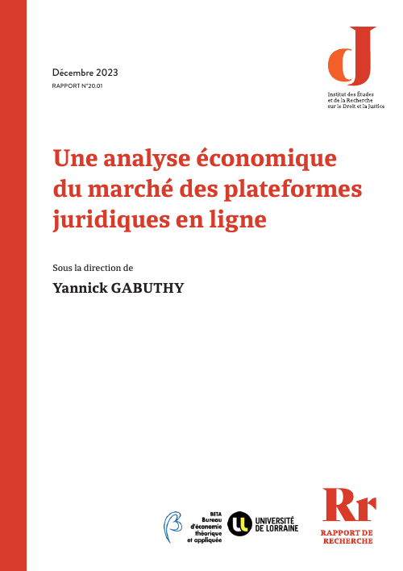

# Décoder l'IA : des promesses des outils aux réalités des usages 

## Nos autres ressources sur ce thème

[Accueil](./index)

<table class="shelf">
  <tr>
    <td>
      
    </td>
    <td>
      
    </td>
    <td>
      
    </td>
  </tr>
  <tr>
    <td>
      
    </td>
    <td>
      <a href="https://institutrobertbadinter.fr/fr/publications/les-nouveaux-defis-de-la-cyberjustice-entre-information-regulation-et-democratie/" title="Les nouveaux défis de la cyberjustice">
        Les nouveaux défis de la cyberjustice
      </a>
    </td>
    <td>
      <a href="https://institutrobertbadinter.fr/fr/publications/big-data-et-droit-penal-utilisation-comprehension-et-impacts-des-techniques-predictives-drop-it/" title="Big data et droit pénal">
        Big data et droit pénal
      </a>
    </td>
  </tr>
  <tr>
    <td>
      <a href="https://institutrobertbadinter.fr/fr/publications/outils-de-justice-predictive-enjeux-et-cartographie-sociologique-des-professionnels-concernes/" title="Outils de justice prédictive">
        Outils de justice prédictive
      </a>
    </td>
    <td>
      <a href="https://institutrobertbadinter.fr/fr/publications/comment-le-numerique-transforme-le-droit-et-la-justice-par-de-nouveaux-usages-et-un-bouleversement-de-la-prise-de-decision-anticiper-les-evolutions-pour-les-accompagner-et-les-maitriser/" title="Comment le numérique transforme le droit et la justice">
        Comment le numérique transforme le droit et la justice
      </a>
    </td>
    <td>
      <a href="https://institutrobertbadinter.fr/fr/publications/cyberjustice-europe-2025/" title="Réalités virtuelles et augmentées dans la justice">
        Réalités virtuelles et augmentées dans la justice
      </a>
    </td>
  </tr>
  <tr>
    <td>
      <a href="https://institutrobertbadinter.fr/fr/publications/parcours-usager-numeriques-procedures-judiciaires/" title="Le parcours usager des justiciables face aux aspects numériques des procédures judiciaires">
        Le parcours usager des justiciables
      </a>
    </td>
    <td>
      
    </td>
    <td>
      <a href="https://institutrobertbadinter.fr/fr/publications/notariat-et-numerique-le-cybernotaire-au-coeur-de-la-republique-numerique-2/" title="Notariat et numérique">
        Notariat et numérique
      </a>
    </td>
  </tr>
  <tr>
    <td>
      <a href="https://institutrobertbadinter.fr/fr/publications/parcours-usager-justiciables/" title="Le parcours usager des justiciables face aux aspects numériques des procédures judiciaires">
        Parcours usager des justiciables
      </a>
    </td>
    <td>
      <a href="https://institutrobertbadinter.fr/fr/publications/seminaire-droit-et-mathematiques/" title="Séminaire droit et mathématiques">
        Séminaire droit et mathématiques
      </a>
    </td>
    <td>
      <a href="https://institutrobertbadinter.fr/fr/publications/vers-un-droit-global-du-numerique-journee-detude-conclusive-du-cycle-dateliers-conventions/" title="Vers un droit global du numérique ?">
        Vers un droit global du numérique ?
      </a>
    </td>
  </tr>
</table>
