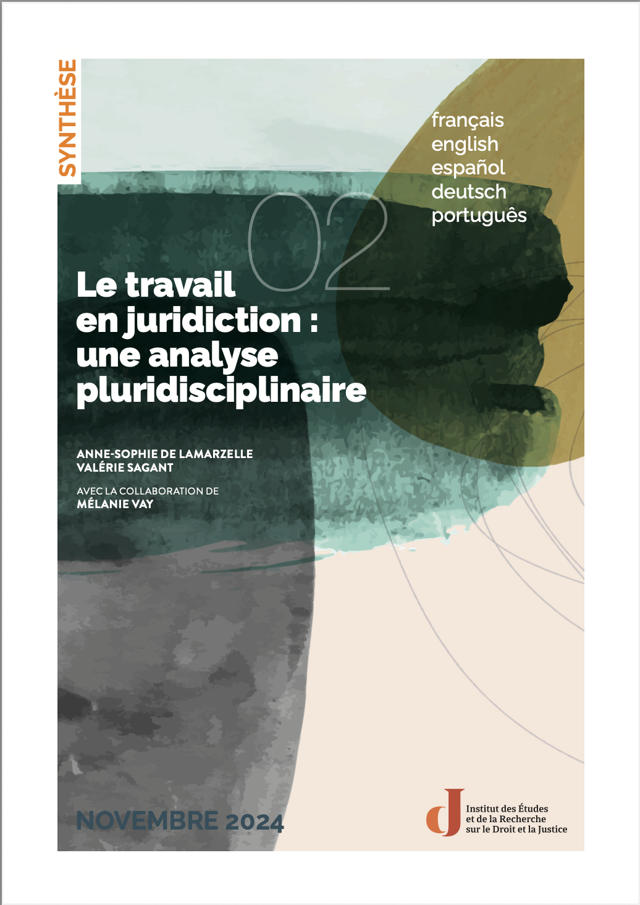

# Legal professions

Welcome to Institut Robert Badinter international ressources on legal professions.

[Home](../index)   

## Court work: a multidisciplinary analysis. Foreword and Summary
[Read on our website]( https://institutrobertbadinter.fr/fr/publications/cooperation-and-complementarity-report-a-new-impetus-for-international-justice/)

Through an interdisciplinary analysis of magistrates, court clerks, and lawyers, this study explores how contemporary transformations are reshaping professional identities within the justice system.
It highlights the decisive role of work organization and professional collectives in preserving both the quality of justice and the meaning practitioners derive from their work.

Available in multiple languages : 
- [Court work: a multidisciplinary analysis. Foreword and Summary](./assets/pdf/travail.pdf#page=29)
- [Die arbeit in der   Gerichtsbarkeit: eine   multidisziplinäre. VORWORT Y ZUSAMMENFASSUNG](./assets/pdf/travail.pdf#page=75)
- [El trabajo en   jurisdicción: un análisis  multidisciplinar](./assets/pdf/travail.pdf#page=51)
- [Trabalho no tribunal:  uma análise multidisciplinar. PREFÁCIO Y RESUMO](./assets/pdf/travail.pdf#page=99) 

> ANNE-SOPHIE DE LAMARZELLE et VALÉRIE SAGANT, « Synthèse de l’étude “Le travail en juridiction :  une analyse   pluridisciplinaire” », Paris, Institut Robert Badinter, 2024.
